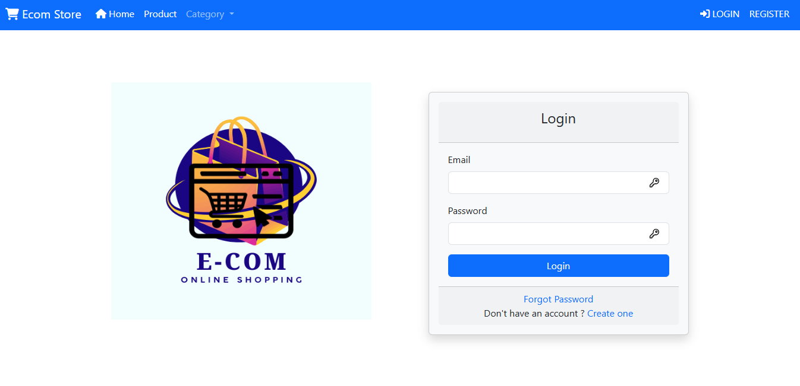
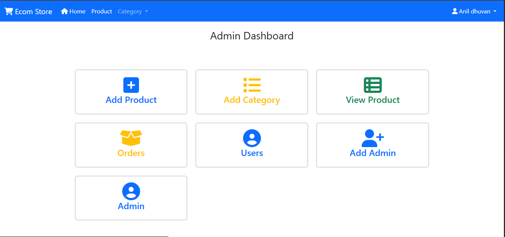
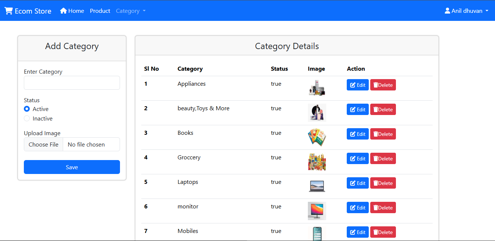
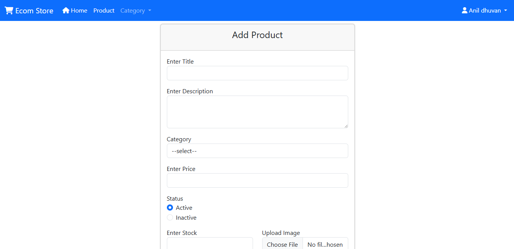
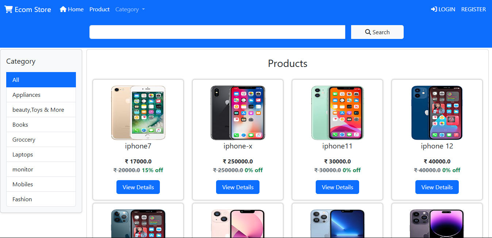
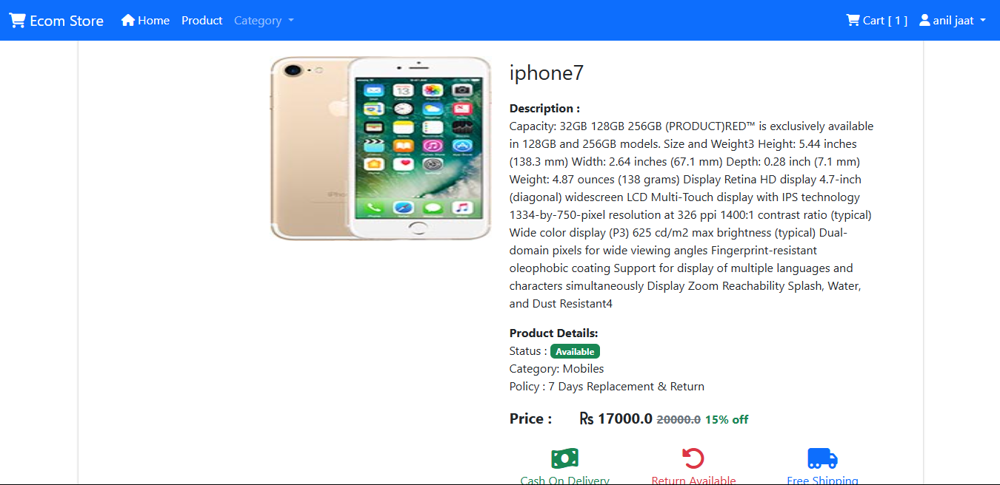
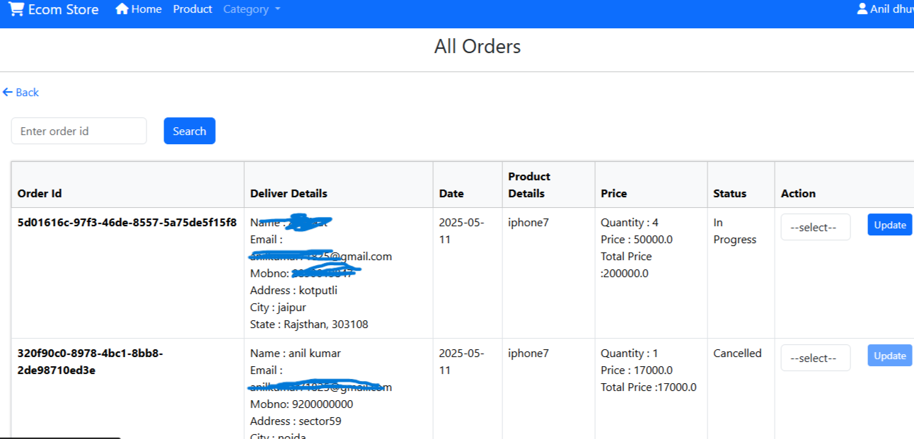
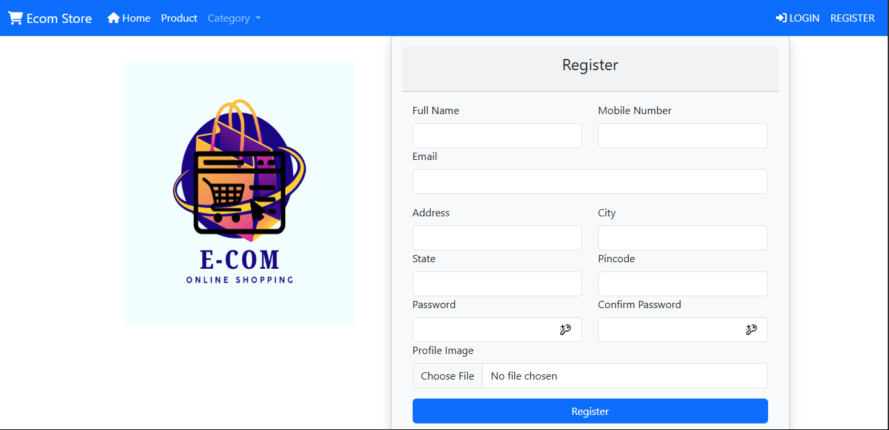
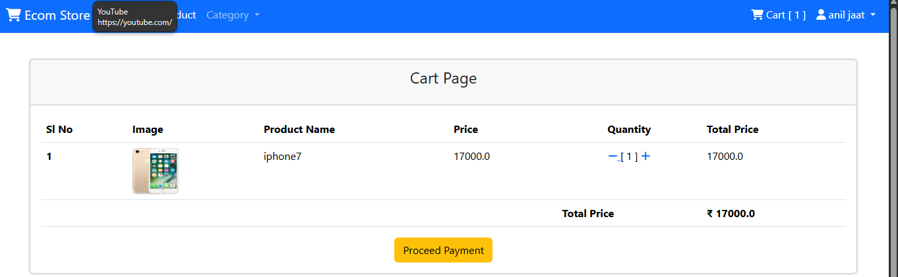
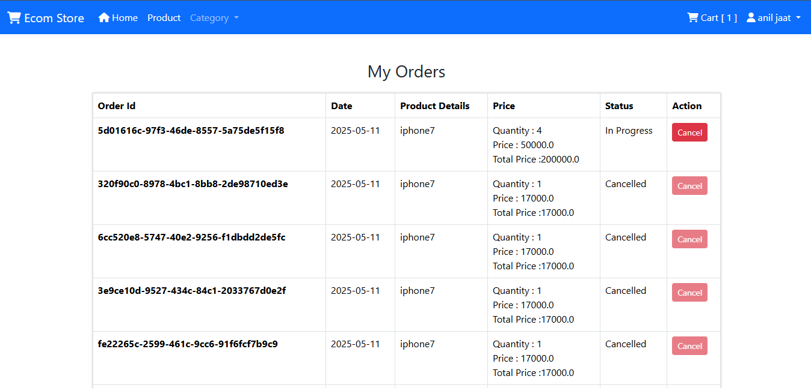

-# Ecom 🛒

**Ecom** is a modern e-commerce web application built with Java Spring Boot for backend, Thymeleaf for server-side rendering, and MySQL for persistent storage. It features secure user registration/login, product browsing, and a responsive shopping experience.

## ✨ Features

- User Registration and Login (Spring Security)
- Role-based access control (Admin & Customer)
- Add/Edit/Delete Products (Admin)
- Browse Products (Customer)
- Shopping cart functionality
- Order placement and tracking
- Responsive UI with Bootstrap
-
## 🔧 Technologies Used

- **Backend**: Spring Boot, Spring MVC, Spring Data JPA
- **Frontend**: Thymeleaf, Bootstrap, HTML/CSS
- **Database**: mongoDB
- **Database**: MySQL
- **Build Tool**: Maven

# E-com project
## Admin
***Admin Login Page***

***Admin Dashbord***

***add categry and categrylist***

***add addproduct***

***AllProduct***

***oneprodactdeatiles and update Prodact***

***orderlist.png***

***create user, user block and unblocak, create user And Admin, payment etc. more functionality.

## User
***User Login Page***

***User Register Page***

***add categry and categrylist***

***AllProduct***

***oneprodactdeatiles***

***cart***

***myorderlist***

***oneprodactdeatiles***

*** payment etc. more functionality.

## 🚀 About Me
I'm a full stack developer...
## 🛠 Skills
 **Backend**: java, J2EE, Spring Boot, Spring MVC, Spring Data JPA, Rest Api, Security, Cloud
- **Frontend**: Thymeleaf, Bootstrap, HTML/CSS, Js
- **Database**: MYSQL

## 🔗 Links
)

)

